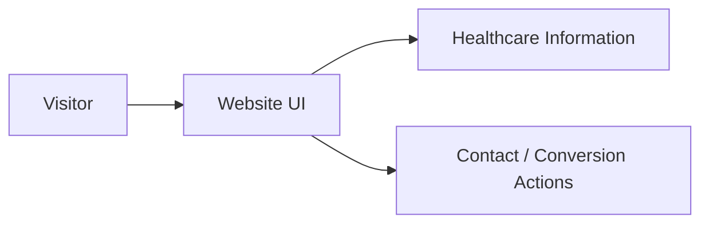

# 🧬 BabyMaker IVF

<p align="center"></p>

<p align="center"><b>A healthcare-focused frontend web project for an IVF-related digital experience.</b></p>

<p align="center">  </p>

## 🌸 Overview
BabyMaker IVF is structured as a modern frontend application. It includes application source, public assets and a Vite configuration, with a production `dist` archive also present in the repository.

## 🚀 Run Locally
```bash
git clone https://github.com/Abhishek7258/BabyMakerIvf.git
cd BabyMakerIvf
npm install
npm run dev
```

Use `package.json` as the source of truth for scripts.

## 📁 Structure
```text
BabyMakerIvf/
├── src/
├── public/
├── index.html
├── package.json
├── vite.config.mjs
└── dist.zip
```

## 🧭 Application Flow


## ⚠️ Healthcare Disclaimer
Website content should not be interpreted as personalized medical advice. Clinical decisions should be made with qualified healthcare professionals.

## 🔐 Privacy
Do not commit patient information, credentials, API keys or other confidential healthcare data to the repository.

## 📸 Screenshots
Add approved screenshots under `docs/screenshots/` to document the real UI.

## 📄 License
No license file is currently declared.